# Projecte d'Infraestructura de Xarxa Segura (OpenData BCN)

Aquest projecte té com a objectiu principal el disseny i la implementació d'una infraestructura de sistemes segura, escalable i professional per allotjar una aplicació web. Aquesta aplicació consumirà i gestionarà dades obertes (Open Data) reals provinents de l'Ajuntament de Barcelona sobre equipaments educatius.

L'entorn simula una arquitectura empresarial real, prioritzant la seguretat mitjançant la segmentació de xarxes (DMZ vs Intranet), l'ús de sistemes operatius Linux (Ubuntu Server) i la configuració manual de serveis crítics d'infraestructura com l'enrutament, el tallafocs, el DHCP i el DNS.

## 1\. Arquitectura de Xarxa

### 1.1. Esquema de la Topologia

```text
      ☁️ INTERNET (Xarxa Default / NAT)
                  |
                  v
      +--------------------------------+
      |      🛡️ ROUTER (R-N01)        |
      |   Firewall / DHCP / DNS        |
      |   IPs: 192.168.10.1 / 110.1    |
      +-------+----------------+-------+
              |                |
              |                |
   (Trànsit Filtrat)    (Trànsit Filtrat)
              |                |
              v                v
+---------------------+  +---------------------+
|  🌐 DMZ (ITB1a)     |  |  🏠 INTRANET (ITB1) |
|  192.168.110.0/24   |  |  192.168.10.0/24    |
+---------------------+  +---------------------+
|                     |  |                     |
| [🖥️ W-N01 (Web)]    |  | [🛢️ B-N01 (BBDD)]   |
|   IP: .110.10       |  |   IP: .10.10        |
|                     |  |                     |
| [📁 F-N01 (FTP)]    |  | [🐧 Clients]        |
|   IP: .110.11       |  |   IP: DHCP (.100+)  |
|                     |  |                     |
+---------------------+  +---------------------+

       FLUXOS DE DADES PERMESOS:
       -------------------------
       1. Clients -> Web (Port 80)
       2. Clients -> FTP (Ports 20/21)
       3. Web -> BBDD (Port 3306 - MySQL)
```

### 1.2. Justificació del Disseny

Hem implementat una arquitectura de "Defensa en Profunditat" dividida en tres zones: Internet, DMZ i Intranet. El nucli és el **Router R-N01**, que centralitza la gestió i actua com a tallafocs. Ubiquem els serveis públics (Web i FTP) a la **DMZ** per aïllar possibles atacs externs, impedint que comprometin la xarxa interna. Els actius crítics, com la **Base de Dades** i els clients, es protegeixen a la **Intranet**, sent inaccessibles des de l'exterior. L'única comunicació permesa entre zones és la estrictament necessària (el web consultant la BBDD), garantint així la màxima seguretat i control de les dades.

## 2\. Esquema de Necessitats Tecnològiques

| Rol / Màquina | Sistema Operatiu | Programari / Serveis Clave | Justificació de l'Elecció |
| :--- | :--- | :--- | :--- |
| **R-N01 (Router)** | Ubuntu Server 22.04 | `netplan`, `iptables`, `isc-dhcp-server`, `bind9` | Nucli de la xarxa. La versió Server garanteix estabilitat i baix consum per gestionar l'encaminament, NAT i seguretat. |
| **B-N01 (BBDD)** | Ubuntu Server 22.04 | `mysql-server` | Servidor dedicat exclusivament a dades. MySQL és l'estàndard robust per a aquests projectes. No requereix interfície gràfica. |
| **W-N01 (Web)** | Ubuntu Server 22.04 | *(A definir)* | Situat a la DMZ. Requerirà un sistema lleuger i fàcil de securitzar. |
| **F-N01 (FTP)** | Ubuntu Server 22.04 | `vsftpd` | Servidor optimitzat per a la transferència ràpida de fitxers entre la Intranet i l'exterior. |
| **Clients** | Ubuntu Desktop | Navegadors, Terminal, `ssh` | Equips amb entorn gràfic (GUI) necessaris per simular l'usuari final, comprovar la web i administrar els servidors visualment. |

-----

## 3\. Desplegament del Router (R-N01)

L'objectiu d'aquesta fase és crear la màquina virtual que actuarà com a enllaç entre totes les nostres xarxes i Internet.

### 3.1. Creació de la VM

Hem creat una nova màquina virtual (`VM`) a IsardVDI amb les següents especificacions:

  * **Plantilla:** Ubuntu Server 22.04 LTS
  * **Nom:** `R-N01`
  * **Targetes de Xarxa:** 3
    1.  Targeta 1: Connectada a `default` ( actuarà com a NAT per sortir a Internet).
    2.  Targeta 2: Connectada a `ITB1` (Intranet).
    3.  Targeta 3: Connectada a `ITB1a` (DMZ).


### 3.2. Planificació de Xarxa i Identificació

Abans de configurar, hem identificat els noms de les interfícies que Ubuntu ha assignat:

  * `enp1s0`: Xarxa `default` (NAT) - Rebrà IP per DHCP d'IsardVDI.
  * `enp2s0`: Xarxa `ITB1` (Intranet) - Li assignarem la IP `192.168.10.1`.
  * `enp3s0`: Xarxa `ITB1a` (DMZ) - Li assignarem la IP `192.168.110.1`.

### 3.3. Configuració de Xarxa (Netplan)

Hem configurat les interfícies de xarxa del router `R-N01` editant el fitxer de configuració de `netplan` (`/etc/netplan/00-installer-config.yaml`).

```bash
sudo nano /etc/netplan/00-installer-config.yaml
```

Aquí hem assignat les IPs estàtiques a `enp2s0` (192.168.10.1/24) i `enp3s0` (192.168.110.1/24), i hem deixat `enp1s0` en mode DHCP.

Un cop configurat, hem aplicat els canvis amb `sudo netplan apply`.


### 3.4. Habilitació de l'Enrutament (IP Forwarding)

Per permetre que el router reenviï paquets entre les interfícies, hem activat l'IP forwarding.

```bash
sudo nano /etc/sysctl.conf
```

Hem descomentat la línia: `net.ipv4.ip_forward=1`


I hem aplicat els canvis sense reiniciar:


### 3.5. Configuració de NAT (iptables)

Per donar sortida a Internet a les nostres xarxes (`ITB1` i `ITB1a`), hem configurat regles de NAT (Network Address Translation) amb `iptables` perquè s'emmascarin darrere la IP de la nostra interfície `default` (`enp1s0`).


### 3.6. Creació de l'Usuari bchecker

Finalment, hem creat l'usuari requerit pel projecte:


-----

## 4\. Implementació del Servei DHCP

L'objectiu és que els clients de la xarxa Intranet (`ITB1`) rebin una configuració de xarxa automàticament.

### 4.1. Instal·lació (a R-N01)

Hem instal·lat el servidor `isc-dhcp-server` a la mateixa màquina `R-N01`.

```bash
sudo apt install -y isc-dhcp-server
```

### 4.2. Configuració de la Interfície d'Escolta

Hem editat el fitxer `/etc/default/isc-dhcp-server` per indicar al servei que només escolti peticions a la interfície de la Intranet (`enp2s0`).

```bash
sudo nano /etc/default/isc-dhcp-server
```

Hem modificat la línia `INTERFACESv4="enp2s0"`.


### 4.3. Definició de l'Abast

Primer hem copiat l'arxiu original per si de cas.


Hem editat el fitxer de configuració principal `/etc/dhcp/dhcpd.conf` per definir el rang d'IPs a repartir (192.168.10.100 a 192.168.10.200), la porta d'enllaç (`option routers`) i els servidors DNS provisionals.

```bash
sudo nano /etc/dhcp/dhcpd.conf
```


Després de desar els canvis, hem reiniciat el servei:

```bash
sudo systemctl restart isc-dhcp-server
```

I hem verificat el seu estat:

```bash
sudo systemctl status isc-dhcp-server
```

A la màquina client Ubuntu Desktop, actualitzem el netplan per rebre'l del router:


Verificació:


Veiem que rep la ip 192.168.10.100, el router funciona i reparteix Ip's.

-----

## 5\. Implementació del Servei DNS

L'objectiu és crear un servidor DNS per resoldre noms interns (com `R-N01`) i complir els requisits del projecte.

### 5.1. Instal·lació (a R-N01)

Hem instal·lat el programari BIND9 al router `R-N01`.

```bash
sudo apt install -y bind9 bind9utils
```

### 5.2. Configuració d'Opcions Globals

Hem editat `/etc/bind/named.conf.options` per definir qui pot consultar el nostre DNS (les nostres xarxes de confiança `acl "trusted"`) i per reenviar peticions externes (com `google.com`) a servidors DNS públics.

```bash
sudo nano /etc/bind/named.conf.options
```


### 5.3. Creació de la Zona DNS Local

Hem definit la nostra zona de domini personalitzada `projecte.G1.0.0` editant el fitxer `/etc/bind/named.conf.local`.

```bash
sudo nano /etc/bind/named.conf.local
```


### 5.4. Creació del Fitxer de Zona

Hem creat el fitxer `/etc/bind/db.projecte.G1.0.0` (on s'ha copiat `/etc/bind/db.local` com a base) per definir el "mapa" de noms a IPs. En aquest fitxer hem afegit els registres 'A' per a:

  * `R-N01` i `R` (apuntant a `192.168.10.1`)
  * `W-N01` (apuntant a `192.168.110.10`)
  * `B-N01` (apuntant a `192.168.10.10`)
  * `F-N01` (apuntant a `192.168.10.11`)

<!-- end list -->

```bash
sudo nano /etc/bind/db.projecte.G1.0.0
```


### 5.5. Validació i Reinici

Hem validat la sintaxi dels nostres fitxers de configuració:

```bash
sudo named-checkconf
sudo named-checkzone projecte.G1.0.0 /etc/bind/db.projecte.G1.0.0
```


En veure `OK`, hem reiniciat el servei BIND9:

```bash
sudo systemctl restart bind9
```

-----

## 6\. Integració de DHCP i DNS

L'últim pas ha estat connectar els dos serveis. Hem modificat el servidor **DHCP** perquè informi els clients que el nostre **nou servidor DNS** és `192.168.10.1` i que el seu domini de cerca és `projecte.G1.0.0`.

Hem tornat a editar el fitxer `/etc/dhcp/dhcpd.conf` per modificar les línies:

  * `option domain-name-servers 192.168.10.1;`
  * `option domain-name "projecte.G1.0.0";`


I hem reiniciat el servei DHCP per aplicar els canvis:

```bash
sudo systemctl restart isc-dhcp-server
```

-----

## 7\. Configuració i Verificació del Client

Finalment, hem configurat el nostre **Client Ubuntu Desktop** (connectat només a la xarxa `G1`) perquè demanés IP per DHCP.

### 7.1. Configuració Netplan (Client)

Hem editat el seu fitxer (`/etc/netplan/01-network-manager-all.yaml`) per activar `dhcp4: true`.

```bash
sudo nano /etc/netplan/01-network-manager-all.yaml
```

Després d'un `sudo netplan apply` (o un reinici), el client ha rebut la IP `192.168.10.100` del DHCP.

### 7.2. Verificació DNS (Client)

La prova final ha estat comprovar que el client havia rebut la informació del domini de cerca:

```bash
cat /etc/resolv.conf
```


I hem confirmat que la resolució de noms i l'enrutament funcionaven:

```bash
ping R
ping W-N01
ping google.com
```


## 8\. Desplegament del Servidor de Base de Dades (B-N01)

Hem desplegat la màquina virtual que allotjarà les dades del projecte.

### 8.1. Creació i Configuració de Xarxa

  * **VM:** Ubuntu Server 22.04 LTS.
  * **Hostname:** `B-N01`.
  * **Xarxa:** Una única interfície connectada a `G1` (Intranet).

Hem configurat una **IP estàtica** editant `/etc/netplan/00-installer-config.yaml` per assegurar que sempre sigui accessible a `192.168.10.10`.

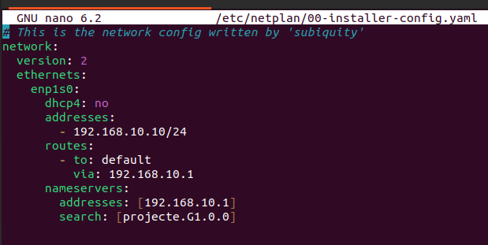

### 8.2. Instal·lació i Securització de MySQL

Hem instal·lat el servidor MySQL:

```bash
sudo apt update && sudo apt install -y mysql-server
```

Hem executat l'script de seguretat `mysql_secure_installation` per establir la contrasenya de `root`, eliminar usuaris anònims i deshabilitar l'accés remot de root.

A més, hem editat `/etc/mysql/mysql.conf.d/mysqld.cnf` per permetre connexions des de la xarxa (canviant `bind-address` de `127.0.0.1` a la IP del servidor `192.168.10.10`).

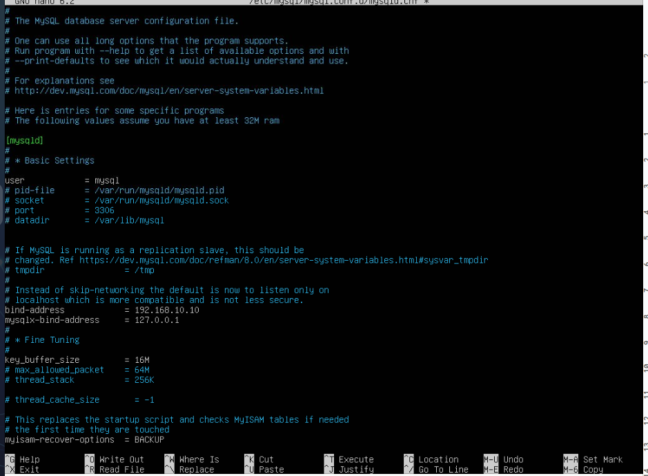

També hem creat l'usuari bchecker

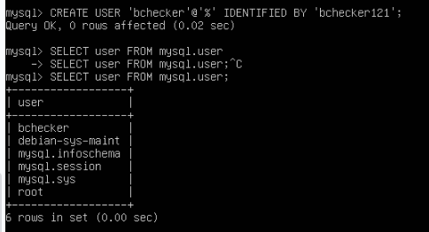

## 9\. Importació de Dades i Gestió d'Usuaris

L'objectiu era carregar un fitxer CSV amb dades d'equipaments educatius de Barcelona a la base de dades.

### 9.1. Transferència del Fitxer CSV

Com que el servidor no té entorn gràfic, hem descarregat el fitxer `.csv` al **Client Ubuntu Desktop** i l'hem transferit al servidor BBDD mitjançant `scp`:

```bash
scp opendatabcn_llista-equipaments_educacio-csv.csv bchecker@192.168.10.10:/tmp/
```

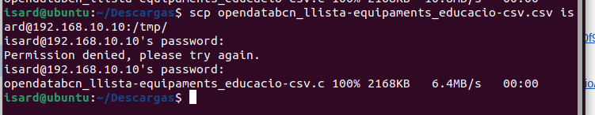

Dins del servidor, hem mogut l'arxiu a la carpeta segura de MySQL per permetre la importació i hem ajustat els permisos.


### 9.2. Creació de l'Estructura i Càrrega

Vam eliminar qualsevol taula existent per començar amb una estructura neta i evitar conflictes

Vam crear una nova taula amb 39 columnes que corresponen exactament als camps del fitxer CSV d'equipaments educatius.

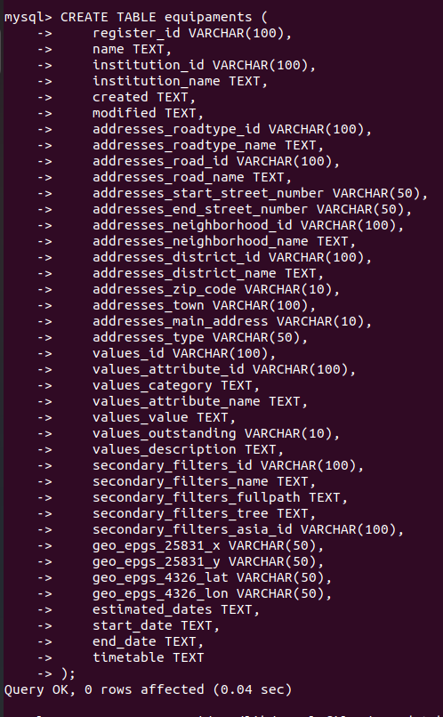

Vam carregar tota la informació del fitxer CSV a la taula, utilitzant la configuració adequada per gestionar cometes, separadors i la fila de capçalera.

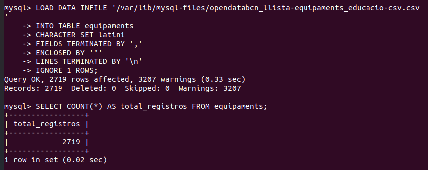

Vam confirmar que la importació es va completar amb èxit comptant el total de registres inserits a la base de dades.

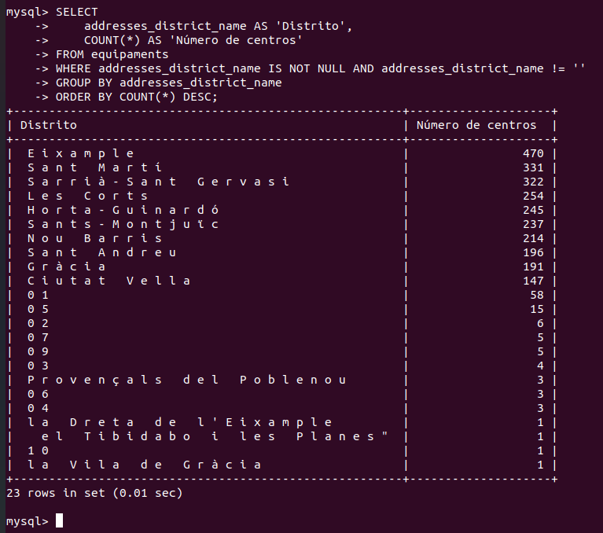

### 9.3.  Resolució d'Incidències de Dades

Ens vam adonar que haver guardat les 39 columnes era una errada, no totes eren rellevants, a més vam detectar durant la verificació de la base de dades, problemes amb el format de les dades importades: caràcters corruptes (codificació incorrecta) i errors de claus duplicades.

#### Conversió de Codificació

El fitxer original estava en format `UTF-16LE`, cosa que generava espais en blanc entre caràcters a MySQL. Vam solucionar-ho convertint l'arxiu a `UTF-8` mitjançant la terminal del servidor BBDD:

```bash
sudo iconv -f UTF-16LE -t UTF-8 opendatabcn.csv -o final.csv
```

#### Reestructuració de la Taula

Per evitar l'error `Duplicate entry` (ja que `id_registre` no era únic al CSV), vam modificar l'estructura de la taula afegint un camp `id_intern` autoincremental com a clau primària (PK).

```sql
CREATE TABLE equipaments (
    id INT NOT NULL AUTO_INCREMENT,
    id_registre VARCHAR(20) DEFAULT NULL,
    nom VARCHAR(255) DEFAULT NULL,
    nom_carrer VARCHAR(255) DEFAULT NULL,
    numero_carrer VARCHAR(50) DEFAULT NULL,
    nom_barri VARCHAR(100) DEFAULT NULL,
    nom_districte VARCHAR(100) DEFAULT NULL,
    codi_postal VARCHAR(10) DEFAULT NULL,
    poblacio VARCHAR(100) DEFAULT NULL,
    latitud DECIMAL(11,8) DEFAULT NULL,
    longitud DECIMAL(11,8) DEFAULT NULL,
    PRIMARY KEY (id)
) ENGINE=InnoDB DEFAULT CHARSET=utf8mb4 COLLATE=utf8mb4_unicode_ci;
```

Amb aquests canvis, la càrrega de dades (`LOAD DATA INFILE`) es va realitzar correctament.

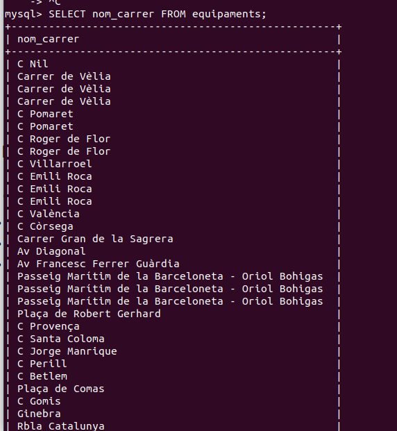

## 10\. Actualització del Router (Firewall)

Finalment, per permetre que la futura aplicació web (que estarà a la DMZ, IP `.110.10`) pugui consultar aquestes dades (a la Intranet, IP `.10.10`), hem afegit una regla específica al tallafocs del Router `R-N01`.

```bash
sudo iptables -A FORWARD -i enp3s0 -o enp2s0 -s 192.168.110.10 -d 192.168.10.10 -p tcp --dport 3306 -j ACCEPT
sudo netfilter-persistent save
```

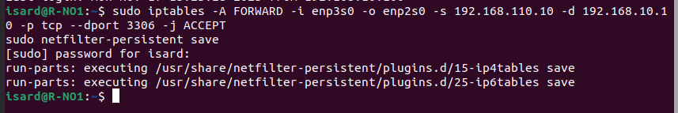
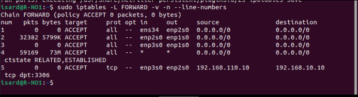


## 11\. Desplegament del Servidor FTP (F-N01)

Hem desplegat un servidor de transferència de fitxers a la **DMZ** (`192.168.110.11`) perquè sigui accessible des de la Intranet però aïllat de les dades crítiques.

### 11.1. Instal·lació i Configuració

Hem utilitzat `vsftpd`. La configuració clau (`/etc/vsftpd.conf`) inclou:

  * **Seguretat:** Usuaris engabiats (`chroot_local_user=YES`) i anònims deshabilitats.
  * **Xarxa:** Configuració de **Ports Passius** (10000-10100) per permetre la connexió a través del tallafocs.

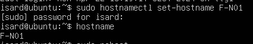

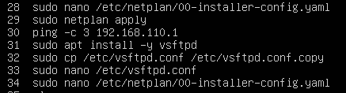

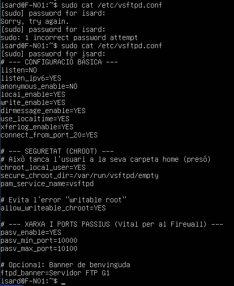


### 11.2. Obertura de Ports al Router

Per permetre que els clients de la Intranet connectin amb la DMZ, hem afegit regles al Router `R-N01` per als ports de control (21), dades actives (20) i passius:

```bash
sudo iptables -A FORWARD -i enp2s0 -o enp3s0 -p tcp --dport 21 -d 192.168.110.11 -j ACCEPT
sudo iptables -A FORWARD -i enp2s0 -o enp3s0 -p tcp --dport 10000:10100 -d 192.168.110.11 -j ACCEPT
```

-----

### 11.3 Comprovació de funcionament

Hem fet una prova per veure si funcionava

Es connecta per la ip i passem un arxiu:

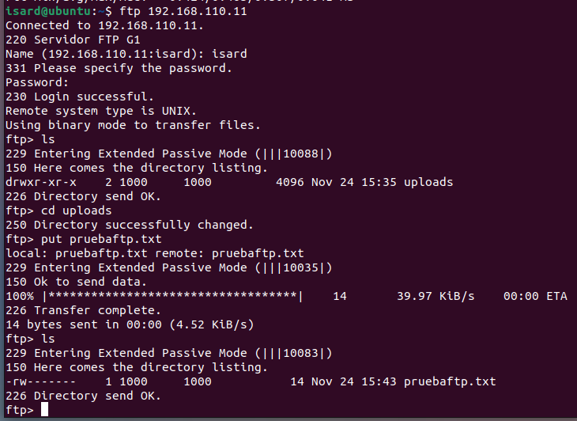

Veiem que s'ha pujat

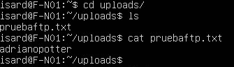

També resol per DNS

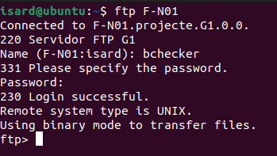


## 12\. Desplegament del Servidor Web (W-N01)

Hem configurat el servidor encarregat de mostrar l'aplicació a la **DMZ** (`192.168.110.10`).

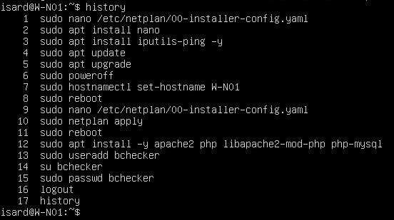

### 12.1. Stack Tecnològic

Hem instal·lat un entorn LAMP lleuger (sense MySQL local, ja que connecta al remot):

  * **Apache2:** Servidor web.
  * **PHP + php-mysql:** Llenguatge de backend i connector de base de dades.

### 12.2. Configuració de Connectivitat

Hem verificat que el servidor web té visibilitat cap al servidor de BBDD (`192.168.10.10`) gràcies a la regla del port 3306 configurada al Router en la fase anterior.


-----

## 13\. Desenvolupament i Implementació de l'Aplicació

Hem desenvolupat amb ajuda de la IA una aplicació web moderna per visualitzar les dades dels equipaments. L'aplicació consta de:

1.  **Backend (PHP):** Un script `get_equipaments.php` que connecta a la BBDD remota, executa la consulta SQL i retorna les dades en format JSON.
2.  **Frontend (JS + Leaflet):** Una interfície que consumeix el JSON i mostra les dades en tres vistes: Taula, Targetes i Mapa interactiu.

-----

## 14\. Verificació amb Client Windows

Per validar la interoperabilitat de la xarxa, hem desplegat un client **Windows 11** a la xarxa Intranet (`ITB1`).

  * **Configuració:** Ha obtingut IP automàticament del nostre servidor DHCP (`R-N01`).
  * **Prova:** Hem accedit a través del navegador a `http://192.168.110.10` (Servidor Web) i hem comprovat que l'aplicació carrega correctament, demostrant que el rutejament i les regles de firewall funcionen per a qualsevol sistema operatiu client.

-----

## 15\. Proves de Sistema i Conclusions

S'han realitzat les següents proves funcionals amb èxit:

| Prova | Origen | Destí | Resultat |
| :--- | :--- | :--- | :--- |
| **Ping** | Client Intranet | Router / Web / FTP | ✅ Èxit |
| **SSH** | Client Intranet | Tots els servidors | ✅ Èxit |
| **MySQL Remot** | Servidor Web (DMZ) | Servidor BBDD (Intranet) | ✅ Èxit (Port 3306 obert) |
| **FTP Upload** | Client Intranet | Servidor FTP (DMZ) | ✅ Èxit (Ports passius OK) |
| **Navegació Web** | Client Windows | Servidor Web (DMZ) | ✅ Èxit |

**Conclusió:** La infraestructura desplegada compleix amb els requisits de seguretat, segmentació i funcionalitat, oferint un entorn robust per a la gestió de dades obertes.