# README: Configuració d'Infraestructura i Serveis de Xarxa

Aquest document detalla el procés pas a pas per configurar la infraestructura de xarxa del projecte, incloent-hi el router `R-N01` i els serveis de xarxa essencials (DHCP i DNS).

## 1\. Tasca 2.1: Desplegament del Router (R-N01)

L'objectiu d'aquesta fase és crear la màquina virtual que actuarà com a enllaç entre totes les nostres xarxes i Internet.

### 1.1. Creació de la VM (IsardVDI)

Hem creat una nova màquina virtual (`VM`) a IsardVDI amb les següents especificacions:

  * **Plantilla:** Ubuntu Server 22.04 LTS
  * **Nom:** `R-N01`
  * **Targetes de Xarxa:** 3
    1.  Targeta 1: Connectada a `default` ( actuarà com a NAT per sortir a Internet).
    2.  Targeta 2: Connectada a `G1` (la nostra futura Intranet).
    3.  Targeta 3: Connectada a `G1a` (la nostra futura DMZ).

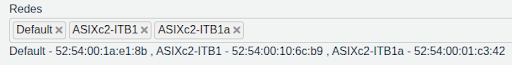

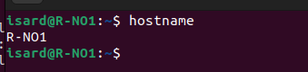

### 1.2. Planificació de Xarxa i Identificació

Abans de configurar, hem identificat els noms de les interfícies que Ubuntu ha assignat:

  * `enp1s0`: Xarxa `default` (NAT) - Rebrà IP per DHCP d'IsardVDI.
  * `enp2s0`: Xarxa `G1` (Intranet) - Li assignarem la IP `192.168.10.1`.
  * `enp3s0`: Xarxa `G1a` (DMZ) - Li assignarem la IP `192.168.110.1`.

### 1.3. Configuració de Xarxa (Netplan)

Hem configurat les interfícies de xarxa del router `R-N01` editant el fitxer de configuració de `netplan` (`/etc/netplan/00-installer-config.yaml`).

```bash
sudo nano /etc/netplan/00-installer-config.yaml
```

Aquí hem assignat les IPs estàtiques a `enp2s0` (192.168.10.1/24) i `enp3s0` (192.168.110.1/24), i hem deixat `enp1s0` en mode DHCP.

Un cop configurat, hem aplicat els canvis amb `sudo netplan apply`.

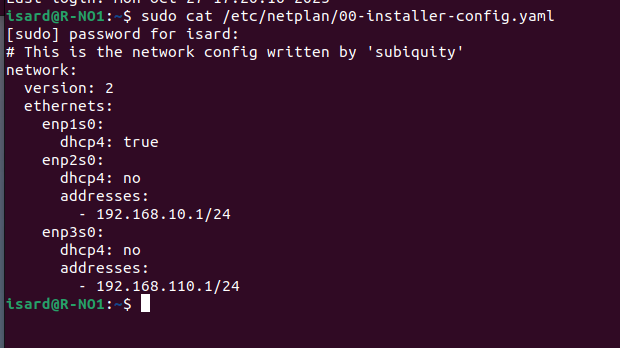
### 1.4. Habilitació de l'Enrutament (IP Forwarding)

Per permetre que el router reenviï paquets entre les interfícies, hem activat l'IP forwarding.

```bash
# Obrim el fitxer de configuració del nucli
sudo nano /etc/sysctl.conf
```

Hem descomentat la línia: `net.ipv4.ip_forward=1`

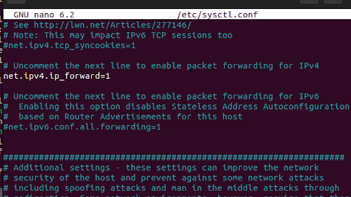

I hem aplicat els canvis sense reiniciar:

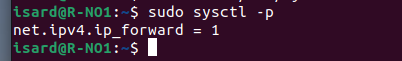

### 1.5. Configuració de NAT (iptables)

Per donar sortida a Internet a les nostres xarxes (`G1` i `G1a`), hem configurat regles de NAT (Network Address Translation) amb `iptables` perquè s'emmascarin darrere la IP de la nostra interfície `default` (`enp1s0`).

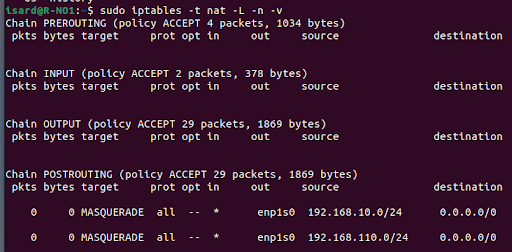


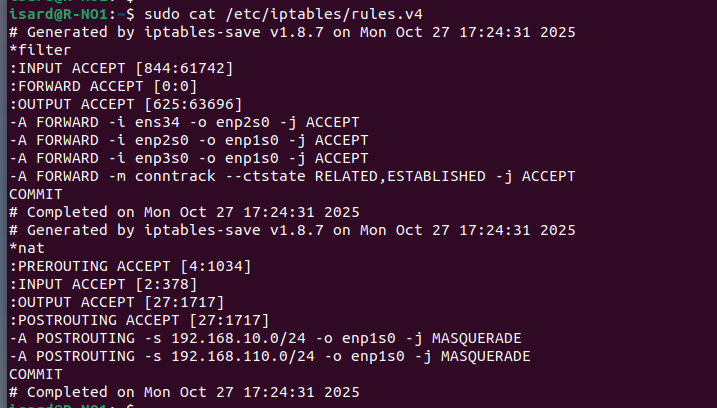

### 1.6. Creació de l'Usuari bchecker

Finalment, hem creat l'usuari requerit pel projecte:


-----

## 2\. Tasca 3.1: Implementació del Servei DHCP

L'objectiu és que els clients de la xarxa Intranet (`G1`) rebin una configuració de xarxa automàticament.

### 2.1. Instal·lació (a R-N01)

Hem instal·lat el servidor `isc-dhcp-server` a la mateixa màquina `R-N01`.

```bash
sudo apt install -y isc-dhcp-server
```

### 2.2. Configuració de la Interfície d'Escolta

Hem editat el fitxer `/etc/default/isc-dhcp-server` per indicar al servei que només escolti peticions a la interfície de la Intranet (`enp2s0`).

```bash
sudo nano /etc/default/isc-dhcp-server
```

Hem modificat la línia `INTERFACESv4="enp2s0"`.

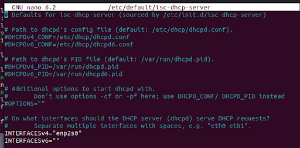

### 2.3. Definició de l'Abast (Scope)

Primer hem copiat l'arxiu original per si de cas.


Hem editat el fitxer de configuració principal `/etc/dhcp/dhcpd.conf` per definir el rang d'IPs a repartir (192.168.10.100 a 192.168.10.200), la porta d'enllaç (`option routers`) i els servidors DNS provisionals.

```bash
sudo nano /etc/dhcp/dhcpd.conf
```

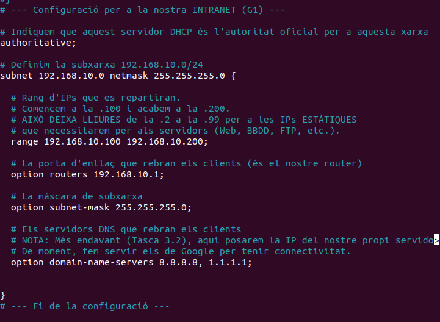

Després de desar els canvis, hem reiniciat el servei:

```bash
sudo systemctl restart isc-dhcp-server
```

I hem verificat el seu estat:

```bash
sudo systemctl status isc-dhcp-server
```

A la màquina client Ubuntu Desktop, actualitzem el netplan per rebre'l del router:

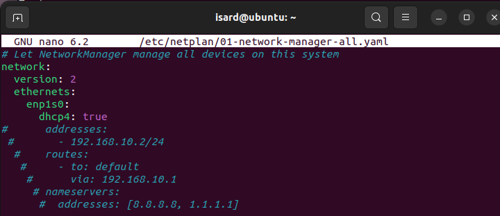

Verificació:

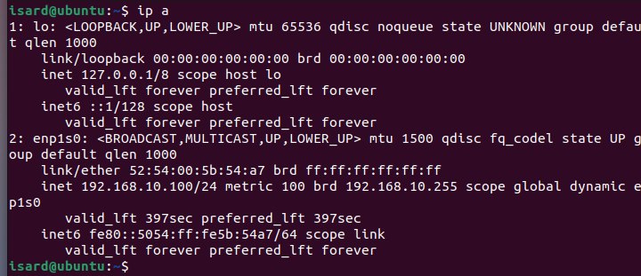

Veiem que rep la ip 192.168.10.100, el router funciona i reparteix Ip's.

-----

## 3\. Tasca 3.2: Implementació del Servei DNS

L'objectiu és crear un servidor DNS per resoldre noms interns (com `R-N01`) i complir els requisits del projecte.

### 3.1. Instal·lació (a R-N01)

Hem instal·lat el programari BIND9 al router `R-N01`.

```bash
sudo apt install -y bind9 bind9utils
```

### 3.2. Configuració d'Opcions Globals

Hem editat `/etc/bind/named.conf.options` per definir qui pot consultar el nostre DNS (les nostres xarxes de confiança `acl "trusted"`) i per reenviar peticions externes (com `google.com`) a servidors DNS públics.

```bash
sudo nano /etc/bind/named.conf.options
```

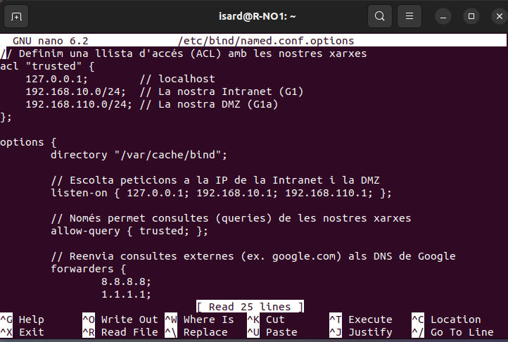
### 3.3. Creació de la Zona DNS Local

Hem definit la nostra zona de domini personalitzada `projecte.G1.0.0` editant el fitxer `/etc/bind/named.conf.local`.

```bash
sudo nano /etc/bind/named.conf.local
```

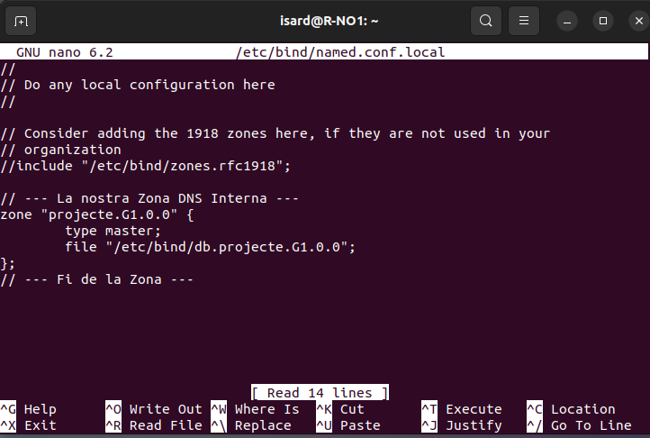

### 3.4. Creació del Fitxer de Zona

Hem creat el fitxer `/etc/bind/db.projecte.G1.0.0` (on s'ha copiat `/etc/bind/db.local` com a base) per definir el "mapa" de noms a IPs. En aquest fitxer hem afegit els registres 'A' per a:

  * `R-N01` i `R` (apuntant a `192.168.10.1`)
  * `W-N01` (apuntant a `192.168.110.10`)
  * `B-N01` (apuntant a `192.168.10.10`)
  * `F-N01` (apuntant a `192.168.10.11`)

<!-- end list -->

```bash
sudo nano /etc/bind/db.projecte.G1.0.0
```

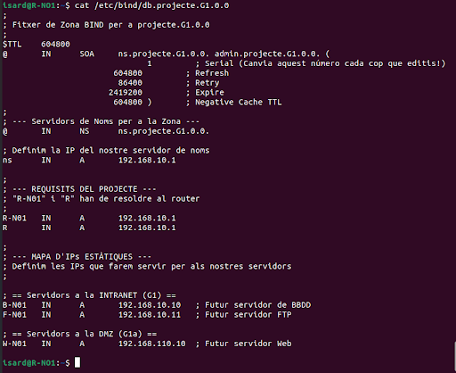


### 3.5. Validació i Reinici

Hem validat la sintaxi dels nostres fitxers de configuració:

```bash
sudo named-checkconf
sudo named-checkzone projecte.G1.0.0 /etc/bind/db.projecte.G1.0.0
```

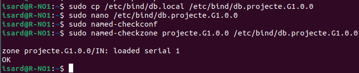

En veure `OK`, hem reiniciat el servei BIND9:

```bash
sudo systemctl restart bind9
```

-----

## 4\. Integració de DHCP i DNS

L'últim pas ha estat connectar els dos serveis. Hem modificat el servidor **DHCP** perquè informi els clients que el nostre **nou servidor DNS** és `192.168.10.1` i que el seu domini de cerca és `projecte.G1.0.0`.

Hem tornat a editar el fitxer `/etc/dhcp/dhcpd.conf` per modificar les línies:

  * `option domain-name-servers 192.168.10.1;`
  * `option domain-name "projecte.G1.0.0";`

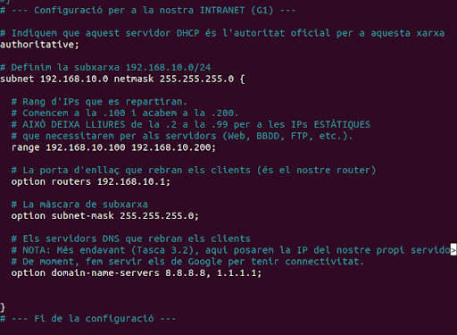

I hem reiniciat el servei DHCP per aplicar els canvis:

```bash
sudo systemctl restart isc-dhcp-server
```

-----

## 5\. Configuració i Verificació del Client

Finalment, hem configurat el nostre **Client Ubuntu Desktop** (connectat només a la xarxa `G1`) perquè demanés IP per DHCP.

### 5.1. Configuració Netplan (Client)

Hem editat el seu fitxer (`/etc/netplan/01-network-manager-all.yaml`) per activar `dhcp4: true`.

```bash
sudo nano /etc/netplan/01-network-manager-all.yaml
```

Després d'un `sudo netplan apply` (o un reinici), el client ha rebut la IP `192.168.10.100` del DHCP.

### 5.2. Verificació DNS (Client)

La prova final ha estat comprovar que el client havia rebut la informació del domini de cerca:

```bash
cat /etc/resolv.conf
```

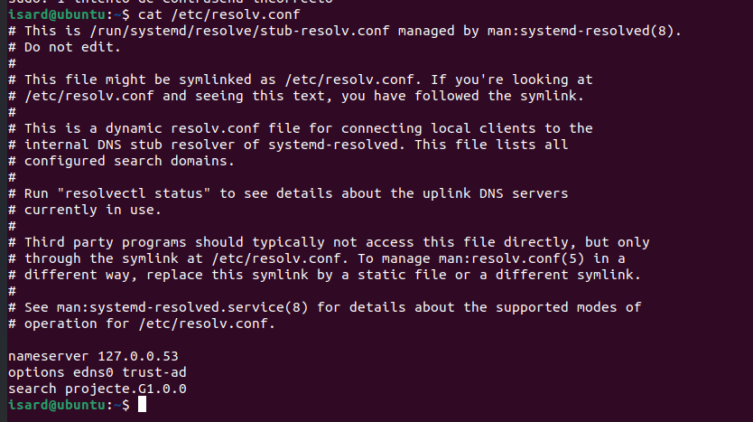

I hem confirmat que la resolució de noms i l'enrutament funcionaven:

```bash
ping R
ping W-N01
ping google.com
```

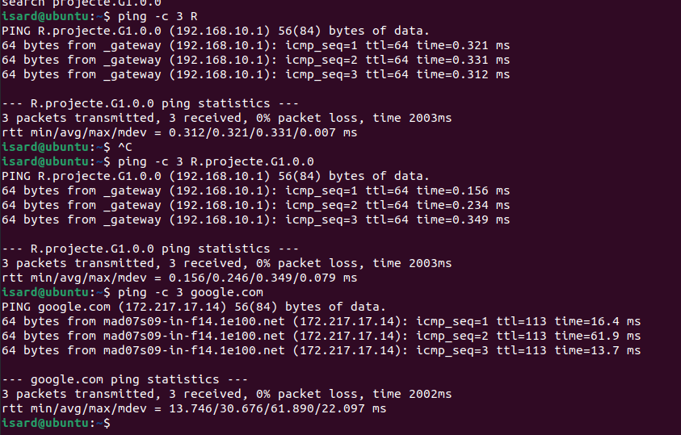


Ja hem acabat l'sprint